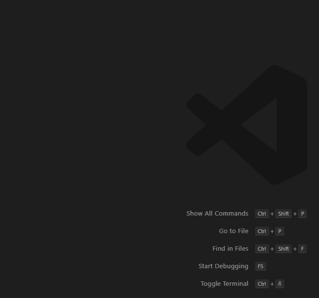

# CCCFeaturesUtils

`CCCFeaturesUtils` is a VSCode extension to help automatize the develpment process of services for the Cloud Compentence Center's Features group.

## Features

- Swagger scaffolding generation to describe a service, based on the information already present in said service. It creates the yaml file.
To run this, either run the `Generate Swagger` command in the command palette or right click in a folder in the file explorer and select `Generate Swagger` from the context menu.

- Converts an existing version (preview) to GA. It changes the `preview` tag from the `task.json` files to `false` and adds an entry in the `Release Notes` of the README. This functionality can be invoked using the `Convert to GA` command from the command palette or the `Convert to GA...` contextual menu in the file explorer.

- Deprecates an existing version of a service. It adds the `deprecate` tag to the `task.json` files, adds a `DEPRECATED` text to the labels, adds an entry in the `Release Notes` of the README and turns the icon to grayscale adding the forbidden image also. This functionality can be invoked using the `Deprecate Service` command from the command palette or the `Deprecate Service...` contextual menu in the file explorer.

- Scaffolds a new task in the tasks folder. It asks for the name of the new task. This functionality can be invoked using the `New Task` command from the command palette or the `New Task...` contextual menu in the file explorer.

- Increases a version of a service. Eg: from 2.0 to 3.0. It creates a copy of the base version and makes the appropiate changes. This functionality can be invoked using the `Increase version` command from the command palette or the `Increase version...` contextual menu in the file explorer.

- Restore packages for a version of a service. It calls `nuget restore -packagesdirectory .packages` for the specified version of a services. This functionality can be invoked using the `Restore Packages` command from the command palette or the `Restore Packages...` contextual menu in the file explorer.

## Installation

Use the `Extensions: Install from VSIX...` from the command palette.

## Requirements

Visual Studio Code version 1.43.0 or up.

## Extension Settings

The extension behaviour can be configured using the settings:

- Regular expression used to validate the working folder (Service/Version).
- Regular expression used to validate the Tasks folder (Service/Version/Tasks).
- Switch to mark a new task as GA when using `New Task` action. Defaults to `false`.
- Switch to overwrite files when using `New Task`. Defaults to `true`.
- List of folder and files to exclude when copying file when `Increase version`. Defaults to `.packages`.
- Switch to generate the swagger file if missing when using `Increase version`. Defaults to `false`.

## Known Issues

- When processing `multiline` fields of a task it has to be checked if it really is an array or a JSON. Because it not always is a string.

## Release Notes

Review the CHANGELOG.

## Future capabilities

- Use progress window in all operations.
- Implement a formatter for README files to prevent common mistakes.
