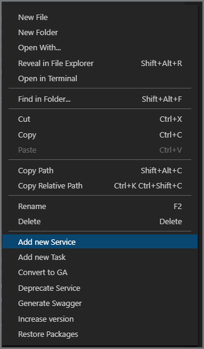
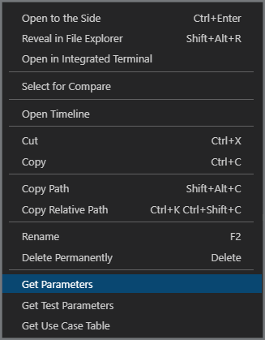
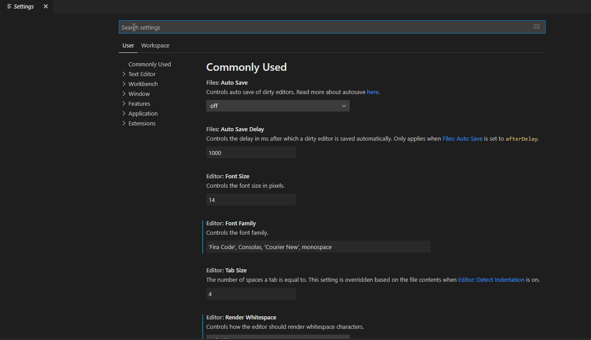

# CCCFeaturesUtils

`CCCFeaturesUtils` is a VSCode extension to help automatize the development process of services for the Cloud Compentence Center's groups (iniatially developed for Features group, hence the name).

## Features

The extension performs a series of actions and informs of the progress and status in the progress bar.

The features are:

- Swagger scaffolding generation to describe a service, based on the information already present in said service. It creates the yaml file.
To run this, either run the `Generate Swagger` command in the command palette or right click in a folder in the file explorer and select `Generate Swagger` from the context menu.

- Converts an existing version (preview) to GA. It changes the `preview` tag from the `task.json` files to `false` and adds an entry in the `Release Notes` of the README. This functionality can be invoked using the `Convert to GA` command from the command palette or the `Convert to GA...` contextual menu in the file explorer.

- Deprecates an existing version of a service. It adds the `deprecate` tag to the `task.json` files, adds a `DEPRECATED` text to the labels, adds an entry in the `Release Notes` of the README and turns the icon to grayscale adding the forbidden image also. This functionality can be invoked using the `Deprecate Service` command from the command palette or the `Deprecate Service...` contextual menu in the file explorer.

- Scaffolds a new task in the tasks folder. It asks for the name of the new task. This functionality can be invoked using the `New Task` command from the command palette or the `New Task...` contextual menu in the file explorer.

- Scaffolds a new service in the services folder. It asks for the name of the new service and it's version (defaults to 1.0). This functionality can be invoked using the `New Service` command from the command palette or the `New Service...` contextual menu in the file explorer.

- Increases a version of a service. Eg: from 2.0 to 3.0. It creates a copy of the base version and makes the appropiate changes. This functionality can be invoked using the `Increase version` command from the command palette or the `Increase version...` contextual menu in the file explorer.

- Restore packages for a version of a service. It calls `nuget restore -packagesdirectory .packages` for the specified version of a services. This functionality can be invoked using the `Restore Packages` command from the command palette or the `Restore Packages...` contextual menu in the file explorer.

- Get the initial structure of the PARAMETERS header of a task. It reads info from the `Task.json` file of a task, opens a new file and writes the info in the new file. This functionality can be invoked using the `Get Parameters` command from the command palette or the `Get Parameters...` contextual menu in the file explorer, if invoked in a `task.json` file.

- Get the table of parameters of a task to use in the Readme. It reads info from the `Task.json` file of a task, opens a new file and writes the info in the new file. This functionality can be invoked using the `Get Use Case Table` command from the command palette or the `Get Use Case Table...` contextual menu in the file explorer, if invoked in a `task.json` file.

- Get the initial structure of a test json file. It reads info from the `Task.json` file of a task, opens a new file and writes the info in the new file. This functionality can be invoked using the `Get Test Parameters` command from the command palette or the `Get Test Parameters...` contextual menu in the file explorer, if invoked in a `task.json` file.

### Command palette


### Context menu on a folder



### Context menu on a `Task.json` file



## Installation

Use the `Extensions: Install from VSIX...` from the command palette.

## Requirements

Visual Studio Code version 1.50.0 or up.

## Extension Settings

The extension behaviour can be configured using the settings:

- Regular expression used to validate the services working folder (/Service).
- Regular expression used to validate the individual service working folder (/Service/Version).
- Regular expression used to validate the Tasks folder (/Service/Version/Tasks).
- Switch to mark a new task as preview when using `New Task` action. Defaults to `true`.
- Switch to overwrite files when using `New Task`. Defaults to `true`.
- List of folder and files to exclude when copying file when `Increase version`. Defaults to `.packages`.
- Switch to generate the swagger file if missing when using `Increase version`. Defaults to `false`.



## Known Issues

- When processing `multiline` fields of a task it has to be checked if it really is an array or if it is a JSON. Because it not always is a string.
- When regenerating a swagger file it does not use existing information. So \[TOCOMPLETE\] placeholders may appear when they are already filled in the previously existing file.

## Release Notes

Review the CHANGELOG.

## Future capabilities

- Implement a formatter for README files to prevent common mistakes.
- Use a list of regular expressions to validate folders, instead of a single one.

## Debug Extension

Put the following JSON in the `launch.json` file, inside the `.vscode` folder to configure extension debugging in VSCode

```json
// A launch configuration that compiles the extension and then opens it inside a new window
// Use IntelliSense to learn about possible attributes.
// Hover to view descriptions of existing attributes.
// For more information, visit: https://go.microsoft.com/fwlink/?linkid=830387
{
    "version": "0.2.0",
    "configurations": [
        {
            "name": "Run Extension",
            "type": "extensionHost",
            "request": "launch",
            "runtimeExecutable": "${execPath}",
            "args": [
                "--extensionDevelopmentPath=${workspaceFolder}"
            ],
            "outFiles": [
                "${workspaceFolder}/dist/**/*.js"
            ],
            "preLaunchTask": "npm: webpack"
        },
        {
            "name": "Run Extension Clean VSCode",
            "type": "extensionHost",
            "request": "launch",
            "runtimeExecutable": "${execPath}",
            "args": [
                "--disable-extensions",
                "--extensionDevelopmentPath=${workspaceFolder}"
            ],
            "outFiles": [
                "${workspaceFolder}/dist/**/*.js"
            ],
            "preLaunchTask": "npm: webpack"
        }
    ]
}
```
